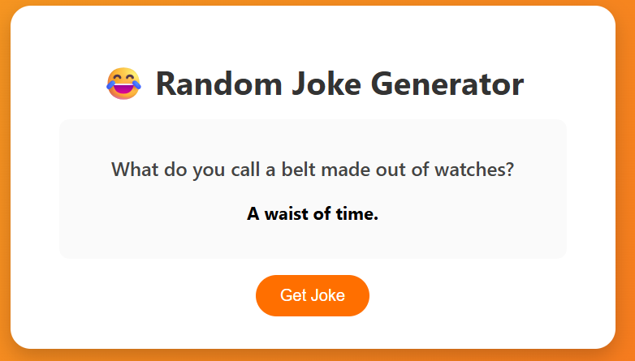

# 😂 Random Joke Generator

A fun and interactive web app that fetches random jokes from the [Official Joke API](https://official-joke-api.appspot.com/random_joke) and displays them with a clean, responsive design.

---

## Features

- Fetches a new joke every time you click the **Get Joke** button.
- Uses `fetch()` to consume a live public API.
- Responsive and visually appealing design using HTML, CSS, and JavaScript.
- Smooth layout with centered joke display and animated transitions.

---

## Screenshots

### Initial Screen

###  Joke Displayed

---

## 🛠️ Technologies Used

- HTML5 – Structure

- CSS3 – Styling

- JavaScript (ES6) – Logic & API integration

- Official Joke API – Source of jokes

___
